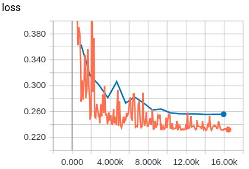
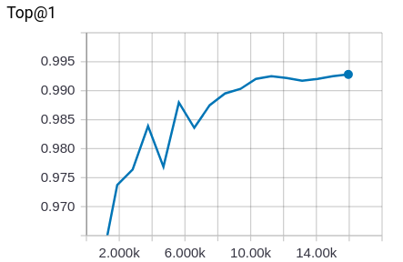

# Randomly Wired Neural Networks

Tensorflow implementation of [Exploring Randomly Wired Neural Networks for Image Recognition](https://arxiv.org/abs/1904.01569) [Saining Xie, Alexander Kirillov, Ross Girshick, Kaiming He] [Arxiv]


 

---
## Requirements

 - Tensorflow 1.13
 - NetworkX
 
---
## Prepare ImageNet TFRecords
 - Download `ILSVRC2012_img_train.tar` , `ILSVRC2012_img_val.tar` , `synset_labels.txt`
 - Put in /your_path/to/data
 ```
 python src/dataset/imagenet_to_tfrecord.py --raw_data_dir /your_path/to/data
                                            --local_scratch_dir /path/to/tfrecords
 ```
 

---
## Training

```
train.py:
  --config: Path to config file
    (default: 'src/config/default.json')
  --num_gpu: If greater or equal to 2, use distribute training
    (default: '1')
  --pretrained: Continue training from this pretrained model
    (default: '')
  --save_path: Path to save ckpt and logging files
    (default: '')
```

### MNIST Example

```
python train.py --config src/config/mnist.json --save_path mnist_example
```

<!-- Loss                       |  Top-1 Accuracy -->
<!-- :-------------------------:|:----------------------------: -->
   


### ImageNet Example

 - Set `config['Data']['root_path']` to your imagenet tfrecords folder
 
```
python train.py --config src/config/regular.json --save_path mnist_example
```

---
## Exported

```
model_dir
|-- eval
|   `-- eval_log
|-- train_log
|-- model.ckpt
`-- rand_graph
    |-- dag_0.txt
    |-- dag_1.txt
    `-- dag_2.txt
```
-  Generated random graph adjacency matrix will be saved as text file

---
## TODO

 - Training on ImageNet
 
---
## License
Apache License 2.0.
